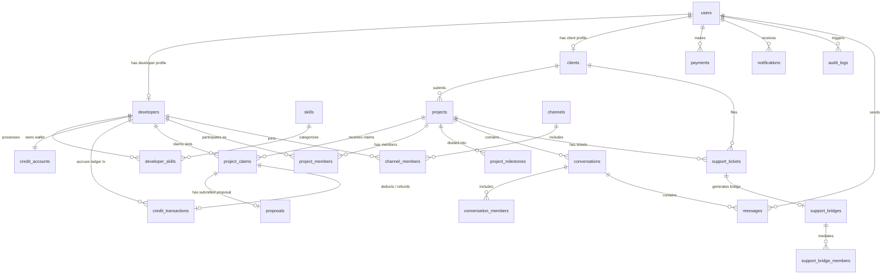

# DATABASE ARCHITECTURE SPECIFICATION

---

## 1. Master Entity-Relationship Diagram (Mermaid)



---

## 2. Relational Table Specifications

### Core User & Profile Entities

#### 1. `users`
- `id` (UUID, PK, Default: `uuid_generate_v4()`)
- `email` (VARCHAR(255), UNIQUE, NOT NULL)
- `phone` (VARCHAR(50), NULL)
- `password_hash` (VARCHAR(255), NOT NULL)
- `role` (ENUM `user_role`: `'CEO'`, `'ADMIN'`, `'MD'`, `'DEVELOPER'`, `'CLIENT'`, `'SUPPORT'`, `'GUEST'`)
- `status` (ENUM `user_status`: `'ACTIVE'`, `'PENDING_VERIFICATION'`, `'SUSPENDED'`)
- `created_at` (TIMESTAMPTZ, Default: `CURRENT_TIMESTAMP`)
- `updated_at` (TIMESTAMPTZ, Default: `CURRENT_TIMESTAMP`)
- **Indexes**: `idx_users_email`, `idx_users_role`

#### 2. `developers`
- `id` (UUID, PK)
- `user_id` (UUID, FK -> `users(id)`, ON DELETE CASCADE)
- `username` (VARCHAR(50), UNIQUE, NOT NULL)
- `display_name` (VARCHAR(150), NOT NULL)
- `bio` (TEXT)
- `profile_image` (VARCHAR(500))
- `location` (VARCHAR(150))
- `role_title` (VARCHAR(150), NOT NULL)
- `experience` (INTEGER, NOT NULL, CHECK: `experience >= 0`)
- `availability` (ENUM `dev_availability`: `'AVAILABLE'`, `'BUSY'`, `'ON_PROJECT'`, `'UNAVAILABLE'`)
- `verification_status` (ENUM `dev_verification`: `'PENDING'`, `'VERIFIED'`, `'REJECTED'`, `'SUSPENDED'`)
- `verified_at` (TIMESTAMPTZ, NULL)
- `github_url` (VARCHAR(255))
- `linkedin_url` (VARCHAR(255))
- `portfolio_url` (VARCHAR(255))
- `leetcode_url` (VARCHAR(255))
- `kaggle_url` (VARCHAR(255))
- **Indexes**: `idx_developers_username`, `idx_developers_user_id`, `idx_developers_status`

#### 3. `skills`
- `id` (UUID, PK)
- `name` (VARCHAR(100), UNIQUE, NOT NULL)
- `category` (VARCHAR(100), NOT NULL)

#### 4. `developer_skills`
- `developer_id` (UUID, FK -> `developers(id)`, ON DELETE CASCADE)
- `skill_id` (UUID, FK -> `skills(id)`, ON DELETE CASCADE)
- `experience_level` (VARCHAR(50), Default: `'ADVANCED'`)
- **PK**: `(developer_id, skill_id)`

#### 5. `clients`
- `id` (UUID, PK)
- `user_id` (UUID, FK -> `users(id)`, ON DELETE CASCADE)
- `client_number` (VARCHAR(50), UNIQUE, NOT NULL) — e.g. `Client #001`, `Client #002`
- `company_name` (VARCHAR(255), NOT NULL)
- `private_name` (VARCHAR(255), NOT NULL)
- `phone` (VARCHAR(50))
- `internal_notes` (TEXT)
- `created_at` (TIMESTAMPTZ)
- **Indexes**: `idx_clients_number`

---

### Project & Marketplace Entities

#### 6. `projects` (The Central Entity)
- `id` (UUID, PK)
- `project_number` (VARCHAR(50), UNIQUE, NOT NULL) — e.g. `PRJ-2026-0001`
- `slug` (VARCHAR(150), UNIQUE, NOT NULL)
- `title` (VARCHAR(255), NOT NULL)
- `description` (TEXT, NOT NULL)
- `category` (VARCHAR(100), NOT NULL)
- `budget_min` (NUMERIC(12,2), CHECK: `budget_min > 0`)
- `budget_max` (NUMERIC(12,2), CHECK: `budget_max >= budget_min`)
- `timeline` (VARCHAR(100), NOT NULL)
- `requirements` (JSONB, Default: `'[]'`)
- `required_technologies` (JSONB, Default: `'[]'`)
- `status` (ENUM `project_status`: `'DRAFT'`, `'SUBMITTED'`, `'REVIEWING'`, `'OPEN_FOR_CLAIMS'`, `'CLAIMS_ACTIVE'`, `'SELECTION_PENDING'`, `'DEVELOPER_SELECTED'`, `'IN_PROGRESS'`, `'SUBMITTED_FOR_REVIEW'`, `'COMPLETED'`, `'PUBLISHED'`, `'CANCELLED'`, `'EXPIRED'`, `'DISPUTED'`, `'ON_HOLD'`)
- `claim_cost` (INTEGER, Default: 1, CHECK: `claim_cost >= 1`)
- `max_claims` (INTEGER, Default: 5, CHECK: `max_claims >= 1`)
- `claim_deadline` (TIMESTAMPTZ, NOT NULL)
- `selection_deadline` (TIMESTAMPTZ)
- `client_id` (UUID, FK -> `clients(id)`, ON DELETE SET NULL)
- `lead_developer_id` (UUID, FK -> `developers(id)`, ON DELETE SET NULL)
- **Indexes**: `idx_projects_number`, `idx_projects_slug`, `idx_projects_status`

#### 7. `project_claims`
- `id` (UUID, PK)
- `project_id` (UUID, FK -> `projects(id)`, ON DELETE CASCADE)
- `developer_id` (UUID, FK -> `developers(id)`, ON DELETE CASCADE)
- `credit_transaction_id` (UUID, FK -> `credit_transactions(id)`)
- `status` (ENUM `claim_status`: `'CLAIMED'`, `'SELECTED'`, `'NOT_SELECTED'`, `'WITHDRAWN'`, `'DISQUALIFIED'`)
- `anonymous_tag` (VARCHAR(50)) — e.g. `Developer #01`, `Developer #02`
- `claimed_at` (TIMESTAMPTZ, Default: `CURRENT_TIMESTAMP`)
- `selected_at` (TIMESTAMPTZ)
- `rejected_at` (TIMESTAMPTZ)
- `refund_transaction_id` (UUID, FK -> `credit_transactions(id)`)
- **Constraints**: `CONSTRAINT uq_project_developer UNIQUE (project_id, developer_id)` (Strictly prevents duplicate claims)
- **Indexes**: `idx_project_claims_project`, `idx_project_claims_dev`

#### 8. `proposals`
- `id` (UUID, PK)
- `project_claim_id` (UUID, UNIQUE, FK -> `project_claims(id)`, ON DELETE CASCADE)
- `approach` (TEXT, NOT NULL)
- `timeline` (VARCHAR(100), NOT NULL)
- `price` (NUMERIC(12,2), CHECK: `price > 0`)
- `milestones` (JSONB)
- `technologies` (JSONB)
- `additional_notes` (TEXT)
- `status` (VARCHAR(50), Default: `'SUBMITTED'`)

#### 9. `project_members`
- `id` (UUID, PK)
- `project_id` (UUID, FK -> `projects(id)`, ON DELETE CASCADE)
- `developer_id` (UUID, FK -> `developers(id)`, ON DELETE CASCADE)
- `role` (ENUM `member_role`: `'LEAD'`, `'CONTRIBUTOR'`)
- `joined_at` (TIMESTAMPTZ, Default: `CURRENT_TIMESTAMP`)
- **Constraints**: `CONSTRAINT uq_project_member UNIQUE (project_id, developer_id)`

---

### Credit Ledger & Financial Entities

#### 10. `credit_accounts`
- `id` (UUID, PK)
- `developer_id` (UUID, UNIQUE, FK -> `developers(id)`, ON DELETE CASCADE)
- `balance` (INTEGER, Default: 0, CHECK: `balance >= 0`) — Balance cannot become negative!

#### 11. `credit_transactions` (The Immutable Double-Entry Ledger)
- `id` (UUID, PK)
- `developer_id` (UUID, FK -> `developers(id)`, ON DELETE CASCADE)
- `project_id` (UUID, NULL, FK -> `projects(id)`, ON DELETE SET NULL)
- `type` (ENUM `credit_tx_type`: `'PURCHASE'`, `'PROJECT_CLAIM'`, `'PROJECT_NOT_SELECTED_REFUND'`, `'PROJECT_CANCEL_REFUND'`, `'WITHDRAWAL_REFUND'`, `'ADMIN_ADJUSTMENT'`, `'EXPIRATION_REFUND'`)
- `amount` (INTEGER, NOT NULL) — e.g. `-1` on claim, `+1` on auto-refund
- `balance_after` (INTEGER, NOT NULL, CHECK: `balance_after >= 0`)
- `reference_id` (VARCHAR(100)) — Idempotent reference (e.g. `REF-{project_id}-{developer_id}`)
- `description` (TEXT, NOT NULL)
- `created_at` (TIMESTAMPTZ, Default: `CURRENT_TIMESTAMP`)
- **Indexes**: `idx_credit_tx_dev`, `idx_credit_tx_project`

#### 12. `payments`
- `id` (UUID, PK)
- `user_id` (UUID, FK -> `users(id)`, ON DELETE CASCADE)
- `amount` (NUMERIC(12,2), NOT NULL)
- `currency` (VARCHAR(10), Default: `'INR'`)
- `gateway` (VARCHAR(50), NOT NULL)
- `gateway_payment_id` (VARCHAR(100), UNIQUE)
- `status` (ENUM `payment_status`: `'PENDING'`, `'SUCCESS'`, `'FAILED'`, `'REFUNDED'`)
- `metadata` (JSONB)
- `created_at` (TIMESTAMPTZ)

---

### Communications, Community & Support Entities

#### 13. `conversations`
- `id` (UUID, PK)
- `project_id` (UUID, NULL, FK -> `projects(id)`, ON DELETE CASCADE)
- `type` (ENUM `conversation_type`: `'PROJECT_PRIVATE'`, `'COMMUNITY_DM'`, `'COMMUNITY_GROUP'`, `'SUPPORT_BRIDGE'`)
- `status` (VARCHAR(50), Default: `'ACTIVE'`)
- `created_at` (TIMESTAMPTZ)
- `closed_at` (TIMESTAMPTZ)

#### 14. `conversation_members`
- `id` (UUID, PK)
- `conversation_id` (UUID, FK -> `conversations(id)`, ON DELETE CASCADE)
- `user_id` (UUID, FK -> `users(id)`, ON DELETE CASCADE)
- `developer_id` (UUID, NULL, FK -> `developers(id)`, ON DELETE SET NULL)
- `client_id` (UUID, NULL, FK -> `clients(id)`, ON DELETE SET NULL)
- `role` (VARCHAR(50), NOT NULL)
- `joined_at` (TIMESTAMPTZ)

#### 15. `messages`
- `id` (UUID, PK)
- `conversation_id` (UUID, FK -> `conversations(id)`, ON DELETE CASCADE)
- `sender_user_id` (UUID, FK -> `users(id)`, ON DELETE CASCADE)
- `message` (TEXT, NOT NULL)
- `message_type` (VARCHAR(50), Default: `'TEXT'`)
- `attachment_url` (VARCHAR(500))
- `reply_to` (UUID, NULL, FK -> `messages(id)`)
- `created_at` (TIMESTAMPTZ)
- `updated_at` (TIMESTAMPTZ)
- `deleted_at` (TIMESTAMPTZ)
- **Indexes**: `idx_messages_conversation`

#### 16. `channels` & `channel_members`
- `channels`: `(id, name UNIQUE, slug UNIQUE, description, is_private, created_by, created_at)`
- `channel_members`: `(channel_id, developer_id)` PRIMARY KEY `(channel_id, developer_id)`

#### 17. `support_tickets` & `support_bridges`
- `support_tickets`: `(id, ticket_number UNIQUE, project_id, client_id, developer_id, subject, description, priority, status, created_at, updated_at, closed_at)`
- `support_bridges`: `(id, ticket_id UNIQUE, created_at, closed_at)`
- `support_bridge_members`: `(id, bridge_id, user_id, role)` (Role: `'CLIENT'`, `'SUPPORT'`, `'DEVELOPER'`)

#### 18. `project_milestones`
- `id` (UUID, PK)
- `project_id` (UUID, FK -> `projects(id)`, ON DELETE CASCADE)
- `title` (VARCHAR(255), NOT NULL)
- `description` (TEXT NOT NULL)
- `status` (ENUM `milestone_status`: `'PENDING'`, `'IN_PROGRESS'`, `'SUBMITTED'`, `'APPROVED'`, `'CHANGES_REQUESTED'`, `'COMPLETED'`)
- `due_date` (TIMESTAMPTZ)
- `completed_at` (TIMESTAMPTZ)
- `order_index` (INTEGER, Default: 0)

#### 19. `audit_logs`
- `id` (UUID, PK)
- `actor_user_id` (UUID, NULL, FK -> `users(id)`, ON DELETE SET NULL)
- `action` (VARCHAR(100), NOT NULL) — e.g. `DEVELOPER_APPROVED`, `CREDIT_ADMIN_ADJUSTMENT`, `DEVELOPER_SELECTED`
- `entity_type` (VARCHAR(100), NOT NULL)
- `entity_id` (VARCHAR(100), NOT NULL)
- `metadata` (JSONB)
- `created_at` (TIMESTAMPTZ)
- **Indexes**: `idx_audit_logs_actor`, `idx_audit_logs_action`

---

## 3. Relationship Explanations

1. **User Separation & Anonymity**:
   `users` represents the authentication boundary. A user can link to a `developer` profile or `client` record. During project selection, only the `client_number` (`Client #001`) and `anonymous_tag` (`Developer #01`) are exposed to counterparties.
2. **Project Centrality**:
   The `projects` table is the hub:
   - Each project has up to `max_claims` records in `project_claims`.
   - Each claim requires a `-1 Credit` ledger transaction in `credit_transactions`.
   - When a client selects a developer, the selected claim becomes `SELECTED` and the developer is added to `project_members` as `LEAD`.
   - All other claims become `NOT_SELECTED` and receive deterministic `+1 Credit` ledger transactions with references `REF-{project_id}-{developer_id}`.
3. **Double-Entry Credit Ledger**:
   `credit_accounts.balance` reflects the current aggregate balance, while `credit_transactions` records every balance change immutably. The balance can never be updated directly without an accompanying ledger row.
4. **Post-Completion Support**:
   When project status reaches `COMPLETED`, normal project chats close. Future inquiries instantiate a `support_tickets` entry (`SUP-2026-0001`) which creates a tripartite `support_bridges` room (Client #001 ↔ Support Agent ↔ Technical Developer).

---

## 4. Migration & Seeding Instructions

### Run Schema Migrations
```bash
# Using PostgreSQL CLI directly:
psql $DATABASE_URL -f database/schema.sql

# Or using the TypeScript migration runner:
npm run db:migrate --workspace=backend
```

### Seed Seed Data
```bash
npm run db:seed --workspace=backend
```

Initial seed data creates:
- **CEO**: Ritesh Lingamallu (`ritesh@nexus.dev`)
- **MD**: M. Shiva Gopi (`shiva@nexus.dev`)
- **Client**: Apex Retail Labs (`Client #001`, `client1@apexretail.io`)
- **Projects**: `PRJ-2026-0001` (PUBLISHED) and `PRJ-2026-0004` (OPEN_FOR_CLAIMS)
- **Community Channels**: `#general`, `#announcements`, `#frontend`, `#backend`, `#ai-ml`, etc.
